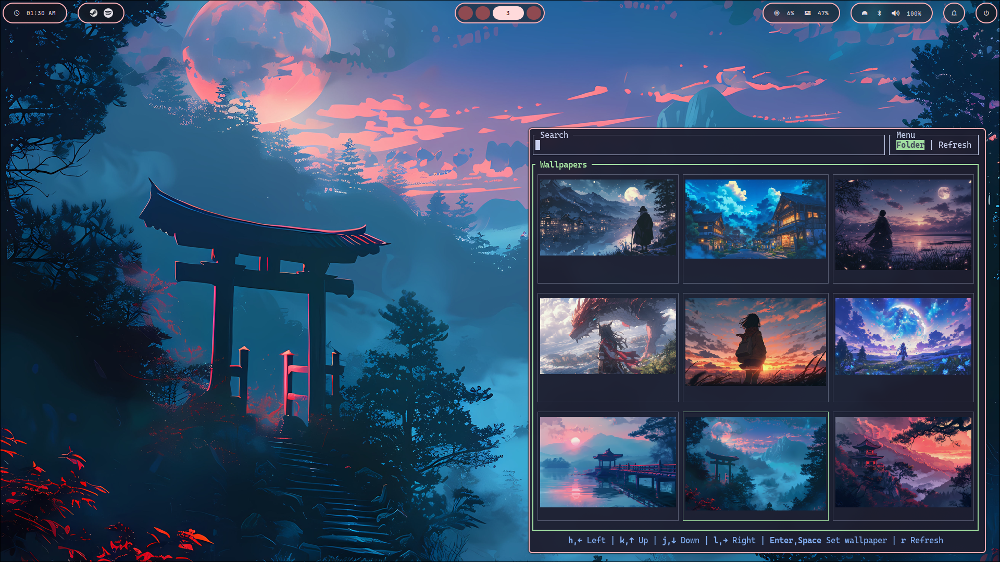

# paper-tui

`paper-tui` is a terminal wallpaper picker for Linux, built with Rust and Ratatui. It lets you browse wallpapers from a folder, preview them directly inside the terminal, search by file name, and run a command after selecting one.

It is designed for setups that already use terminal-native wallpaper tools such as `awww`, and works best as a lightweight TUI frontend for your existing wallpaper workflow.



## Terminal support

`paper-tui` renders image previews in the terminal, so it only works properly in terminals that support a terminal graphics protocol, such as Kitty, Ghostty, iTerm2, or Sixel-compatible terminals.

> [!NOTE]
>
> Thumbnails are generated lazily and cached in your user cache directory for faster loading after the first run.
>
> `paper-tui` is intended primarily for Linux desktop setups and is most useful when paired with an external wallpaper setter in `post_command`. It may also work with macOS; don't take my word for it.

## Installation

### From crates.io

```sh
cargo install paper-tui
```

### From source

```sh
git clone https://github.com/yourname/paper-tui.git
cd paper-tui
cargo build --release
```

The compiled binary will be available at:

```sh
target/release/paper-tui
```

## Configuration

Config file location:

```sh
~/.config/paper-tui/config.toml
```

Example:

```toml
wallpapers_dir = "/home/user/Pictures"
post_command = "awww img {wallpaper} && matugen image {wallpaper} --source-color-index 1"
```

`wallpapers_dir` is the directory that `paper-tui` will scan for images. `post_command` is optional, and `{wallpaper}` will be replaced with the full path of the selected image.
